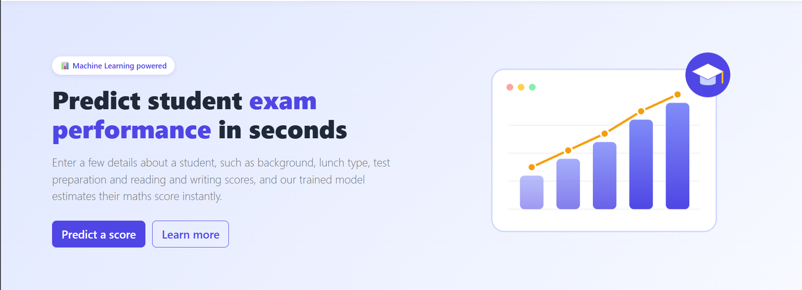
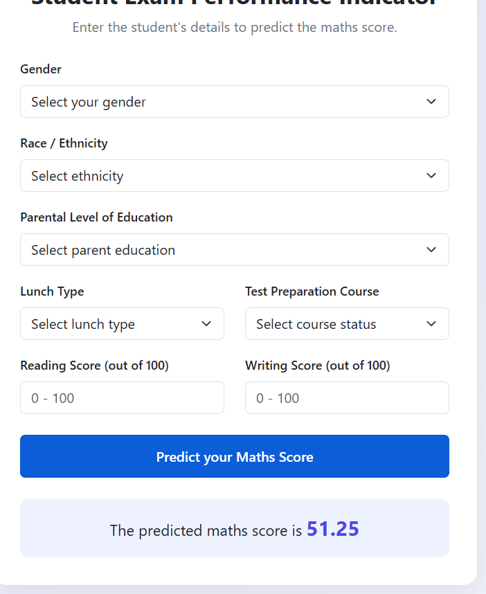

# 🎓 Student Exam Performance Indicator

A machine learning web app that predicts a student's **maths score** from their background and reading/writing scores. Built end to end: data pipeline, model training and a Flask web interface.

## 🖼️ Demo

| Landing page | Prediction form |
|:---:|:---:|
|  |  |

## 🧰 Tech Stack

Python · Flask · scikit-learn · Pandas · NumPy · Bootstrap 5

## 👤 Author

**Your Name** · [GitHub](https://github.com/your-username) · [LinkedIn](https://www.linkedin.com/in/your-profile)
